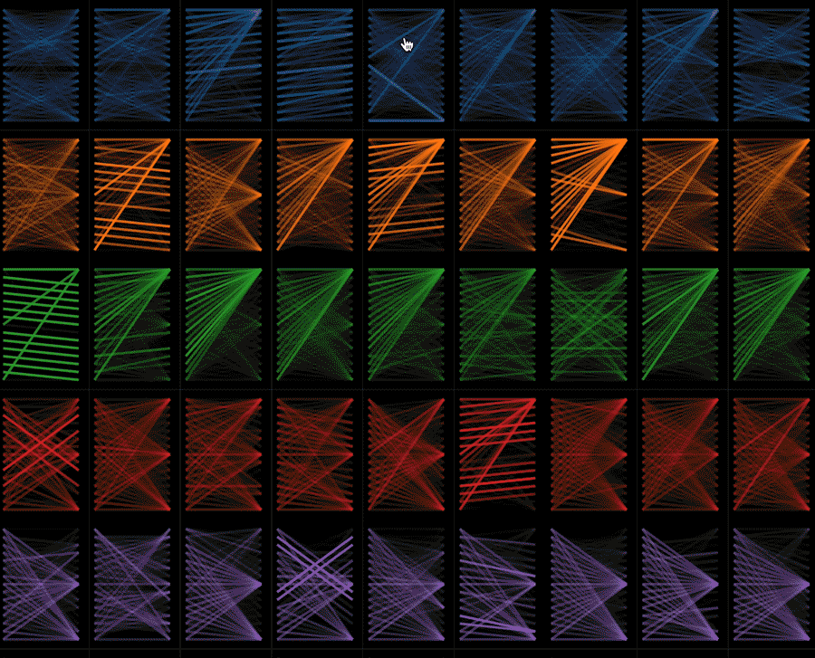
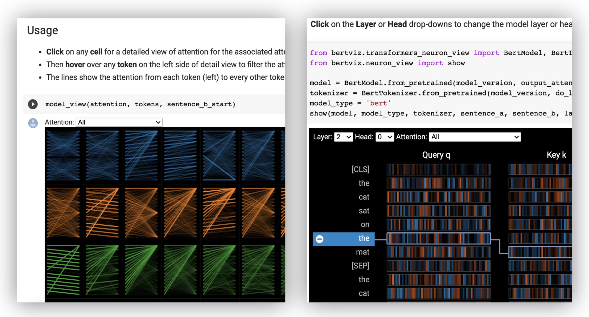

<h1 align="center">
    BertViz
</h1>
<h3 align="center">
 Visualize Attention in NLP Models
</h3>
<h3 align="center">
    <a href="#-quick-tour">Quick Tour</a> &bull;
    <a href="#%EF%B8%8F-getting-started">Getting Started</a> &bull;
    <a href="https://colab.research.google.com/drive/1hXIQ77A4TYS4y3UthWF-Ci7V7vVUoxmQ?usp=sharing">Colab Tutorial</a> &bull;
    <a href="#-paper">Paper</a>
</h3>

BertViz is an interactive tool for visualizing attention in [Transformer](https://jalammar.github.io/illustrated-transformer/) language models such as BERT, GPT2, or T5. It can be run inside a Jupyter or Colab
 notebook through a simple Python API that supports most [Huggingface models](https://huggingface.co/models). BertViz extends the
   [Tensor2Tensor visualization tool](https://github.com/tensorflow/tensor2tensor/tree/master/tensor2tensor/visualization)
    by [Llion Jones](https://medium.com/@llionj), providing multiple views that each offer a unique lens into the attention mechanism.


## 🚀 Quick Tour

### Head View
The *head view* visualizes attention for one or more attention heads in the same 
 layer. It is based on the excellent [Tensor2Tensor visualization tool](https://github.com/tensorflow/tensor2tensor/tree/master/tensor2tensor/visualization) by [Llion Jones](https://medium.com/@llionj). 

🕹 Try out the head view in the [<b><u>Interactive Colab Tutorial</u></b>](https://colab.research.google.com/drive/1hXIQ77A4TYS4y3UthWF-Ci7V7vVUoxmQ?usp=sharing) (all visualizations pre-loaded).
<p>
    
</p>


### Model View 

The *model view* shows a bird's-eye view of attention across all layers and heads.

🕹 Try out the model view in the [<b><u>Interactive Colab Tutorial</u></b>](https://colab.research.google.com/drive/1hXIQ77A4TYS4y3UthWF-Ci7V7vVUoxmQ?usp=sharing) (all visualizations pre-loaded).



### Neuron View 
The *neuron view* visualizes individual neurons in the query and key vectors and shows how they are used to compute attention.

🕹 Try out the neuron view in the [<b><u>Interactive Colab Tutorial</u></b>](https://colab.research.google.com/drive/1hXIQ77A4TYS4y3UthWF-Ci7V7vVUoxmQ?usp=sharing) (all visualizations pre-loaded).


## ⚡️ Getting Started

### Running BertViz in a Jupyter Notebook

From the command line:

```bash
pip install bertviz
```
You must also have Jupyter Notebook and ipywidgets installed:

```bash
pip install jupyterlab
pip install ipywidgets
```
(If you run into any issues installing Jupyter or ipywidgets, consult the documentation [here](https://jupyter.org/install) and [here](https://ipywidgets.readthedocs.io/en/stable/user_install.html).)

To create a new Jupyter notebook, simply run:

```bash
jupyter lab
```

Then click `New` and select `Python 3 (ipykernel)` if prompted.


### Running BertViz in Colab

To run in [Colab](https://colab.research.google.com/), simply add the following cell at the beginning of your Colab notebook:

```
!pip install bertviz
```

### Sample code
Run the following code to load the `xtremedistil-l12-h384-uncased` model and display it in the model view: 

```python
from transformers import AutoTokenizer, AutoModel, utils
from bertviz import model_view
utils.logging.set_verbosity_error()  # Suppress standard warnings

model_name = "microsoft/xtremedistil-l12-h384-uncased"  # Find popular HuggingFace models here: https://huggingface.co/models
input_text = "The cat sat on the mat"  
model = AutoModel.from_pretrained(model_name, output_attentions=True)  # Configure model to return attention values
tokenizer = AutoTokenizer.from_pretrained(model_name)
inputs = tokenizer.encode(input_text, return_tensors='pt')  # Tokenize input text
outputs = model(inputs)  # Run model
attention = outputs[-1]  # Retrieve attention from model outputs
tokens = tokenizer.convert_ids_to_tokens(inputs[0])  # Convert input ids to token strings
model_view(attention, tokens)  # Display model view
```

The visualization may take a few seconds to load. Feel free to experiment with different input texts and
 [models](https://huggingface.co/models). 
See [Documentation](#-documentation) for additional use cases and examples, e.g., encoder-decoder models.

#### Running sample notebooks

You may also run any of the sample [notebooks](notebooks/) included with BertViz:

```bash
git clone --depth 1 git@github.com:jessevig/bertviz.git
cd bertviz/notebooks
jupyter lab
```
## 🕹 Interactive Tutorial

Check out the [<b><u>Interactive Colab Tutorial</u></b>](https://colab.research.google.com/drive/1hXIQ77A4TYS4y3UthWF-Ci7V7vVUoxmQ?usp=sharing) 
to learn more about BertViz and try out the tool. <b>Note</b>: all visualizations are pre-loaded, so there is no need to execute any cells.

[](https://colab.research.google.com/drive/1hXIQ77A4TYS4y3UthWF-Ci7V7vVUoxmQ?usp=sharing)


## 📖 Documentation

### Table of contents

- [Self-attention models (BERT, GPT-2, etc.)](#self-attention-models-bert-gpt-2-etc)
  * [Head and Model Views](#head-and-model-views)
  * [Neuron View](#neuron-view-1)
- [Encoder-decoder models (BART, T5, etc.)](#encoder-decoder-models-bart-t5-etc)
- [Installing from source](#installing-from-source)
- [Additional options](#additional-options)
  * [Dark / light mode](#dark--light-mode)
  * [Filtering layers](#filtering-layers)
  * [Setting default layer/head(s)](#setting-default-layerheads)
  * [Visualizing sentence pairs](#visualizing-sentence-pairs)
  * [Obtain HTML representations](#obtain-HTML-representations)
  * [Non-Huggingface models](#non-huggingface-models)
 - [Limitations](#%EF%B8%8F-limitations)

### Self-attention models (BERT, GPT-2, etc.)

#### Head and Model Views
First load a Huggingface model, either a pre-trained model as shown below, or your own fine-tuned model.
 Be sure to set `output_attentions=True`.
```python
from transformers import AutoTokenizer, AutoModel, utils
utils.logging.set_verbosity_error()  # Suppress standard warnings
tokenizer = AutoTokenizer.from_pretrained("bert-base-uncased")
model = AutoModel.from_pretrained("bert-base-uncased", output_attentions=True)
```

Then prepare inputs and compute attention:

```python
inputs = tokenizer.encode("The cat sat on the mat", return_tensors='pt')
outputs = model(inputs)
attention = outputs[-1]  # Output includes attention weights when output_attentions=True
tokens = tokenizer.convert_ids_to_tokens(inputs[0]) 
```

Finally, display the attention weights using the [`head_view`](bertviz/head_view.py) or [`model_view`](bertviz/model_view.py)
 functions:

```python
from bertviz import head_view
head_view(attention, tokens)
```

<b>Examples</b>: DistilBERT ([Model View Notebook](notebooks/model_view_distilbert.ipynb), [Head View Notebook](notebooks/head_view_distilbert.ipynb))

For full API, please refer to the source code for the [head view](bertviz/head_view.py) or [model view](bertviz/model_view.py).


#### Neuron View

The neuron view is invoked differently than the head view or model view, due to requiring access to the model's
query/key vectors, which are not returned through the Huggingface API. It is currently limited to custom versions of BERT, GPT-2, and
RoBERTa included with BertViz.

```python
# Import specialized versions of models (that return query/key vectors)
from bertviz.transformers_neuron_view import BertModel, BertTokenizer
from bertviz.neuron_view import show

model_type = 'bert'
model_version = 'bert-base-uncased'
do_lower_case = True
sentence_a = "The cat sat on the mat"
sentence_b = "The cat lay on the rug"
model = BertModel.from_pretrained(model_version, output_attentions=True)
tokenizer = BertTokenizer.from_pretrained(model_version, do_lower_case=do_lower_case)
show(model, model_type, tokenizer, sentence_a, sentence_b, layer=2, head=0)
```

<b>Examples</b>:
BERT ([Notebook](notebooks/neuron_view_bert.ipynb),
[Colab](https://colab.research.google.com/drive/1m37iotFeubMrp9qIf9yscXEL1zhxTN2b)) •
GPT-2 ([Notebook](notebooks/neuron_view_gpt2.ipynb),
[Colab](https://colab.research.google.com/drive/1s8XCCyxsKvNRWNzjWi5Nl8ZAYZ5YkLm_)) •
RoBERTa
([Notebook](notebooks/neuron_view_roberta.ipynb))  

For full API, please refer to the [source](bertviz/neuron_view.py).

### Encoder-decoder models (BART, T5, etc.)

The head view and model view both support encoder-decoder models.

First, load an encoder-decoder model:

```python
from transformers import AutoTokenizer, AutoModel

tokenizer = AutoTokenizer.from_pretrained("Helsinki-NLP/opus-mt-en-de")
model = AutoModel.from_pretrained("Helsinki-NLP/opus-mt-en-de", output_attentions=True)
```

Then prepare the inputs and compute attention:
```python
encoder_input_ids = tokenizer("She sees the small elephant.", return_tensors="pt", add_special_tokens=True).input_ids
with tokenizer.as_target_tokenizer():
    decoder_input_ids = tokenizer("Sie sieht den kleinen Elefanten.", return_tensors="pt", add_special_tokens=True).input_ids

outputs = model(input_ids=encoder_input_ids, decoder_input_ids=decoder_input_ids)

encoder_text = tokenizer.convert_ids_to_tokens(encoder_input_ids[0])
decoder_text = tokenizer.convert_ids_to_tokens(decoder_input_ids[0])
```

Finally, display the visualization using either [`head_view`](bertviz/head_view.py) or [`model_view`](bertviz/model_view.py).
```python
from bertviz import model_view
model_view(
    encoder_attention=outputs.encoder_attentions,
    decoder_attention=outputs.decoder_attentions,
    cross_attention=outputs.cross_attentions,
    encoder_tokens= encoder_text,
    decoder_tokens = decoder_text
)
```

You may select `Encoder`, `Decoder`, or `Cross` attention from the drop-down in the upper left corner of the visualization.

<b>Examples</b>: MarianMT ([Notebook](notebooks/model_view_encoder_decoder.ipynb)) • BART ([Notebook](notebooks/model_view_bart.ipynb))

For full API, please refer to the source code for the [head view](bertviz/head_view.py) or [model view](bertviz/model_view.py).

### Installing from source
```bash
git clone https://github.com/jessevig/bertviz.git
cd bertviz
python setup.py develop
```

### Additional options

#### Dark / light mode

The model view and neuron view support dark (default) and light modes. You may set the mode using
the `display_mode` parameter:
```python
model_view(attention, tokens, display_mode="light")
```


#### Filtering layers

To improve the responsiveness of the tool when visualizing larger models or inputs, you may set the `include_layers`
 parameter to restrict the visualization to a subset of layers (zero-indexed). This option is available in the head view and model
view.

**Example:** Render model view with only layers 5 and 6 displayed
```python
model_view(attention, tokens, include_layers=[5, 6])
```

For the model view, you may also restrict the visualization to a subset of attention heads (zero-indexed) by setting the 
`include_heads` parameter. 


#### Setting default layer/head(s)

In the head view, you may choose a specific `layer` and collection of `heads` as the default selection when the
 visualization first renders. Note: this is different from the `include_heads`/`include_layers` parameter (above), which 
 removes layers and heads from the visualization completely.

**Example:** Render head view with layer 2 and heads 3 and 5 pre-selected
```python
head_view(attention, tokens, layer=2, heads=[3,5])
```

You may also pre-select a specific `layer` and single `head` for the neuron view. 

#### Visualizing sentence pairs

Some models, e.g. BERT, accept a pair of sentences as input. BertViz optionally supports a drop-down menu that allows 
user to filter attention based on which sentence the tokens are in, e.g. only show attention between tokens in first
 sentence and tokens in second sentence.
 
 
##### Head and model views
To enable this feature when invoking the [`head_view`](bertviz/head_view.py) or [`model_view`](bertviz/model_view.py) functions, set
 the `sentence_b_start` parameter to the start index of the second sentence. Note that the method for computing this
 index will depend on the model.
 
Example (BERT):

```python
from bertviz import head_view
from transformers import AutoTokenizer, AutoModel, utils
utils.logging.set_verbosity_error()  # Suppress standard warnings

# NOTE: This code is model-specific
model_version = 'bert-base-uncased'
model = AutoModel.from_pretrained(model_version, output_attentions=True)
tokenizer = AutoTokenizer.from_pretrained(model_version)
sentence_a = "the rabbit quickly hopped"
sentence_b = "The turtle slowly crawled"
inputs = tokenizer.encode_plus(sentence_a, sentence_b, return_tensors='pt')
input_ids = inputs['input_ids']
token_type_ids = inputs['token_type_ids'] # token type id is 0 for Sentence A and 1 for Sentence B
attention = model(input_ids, token_type_ids=token_type_ids)[-1]
sentence_b_start = token_type_ids[0].tolist().index(1) # Sentence B starts at first index of token type id 1
token_ids = input_ids[0].tolist() # Batch index 0
tokens = tokenizer.convert_ids_to_tokens(token_ids)    
head_view(attention, tokens, sentence_b_start)
``` 


##### Neuron view

To enable this option in the neuron view, simply set the `sentence_a` and `sentence_b` parameters in [`neuron_view.show()`](bertviz/neuron_view.py).

#### Obtain HTML representations

Support to retrieve the generated HTML representations has been added to head_view, model_view and neuron_view.

Setting the 'html_action' parameter to 'return' will make the function call return a single HTML Python object that can be further processed. Remember you can access the HTML source using the data attribute of a Python HTML object.

The default behavior for 'html_action' is 'view', which will display the visualization but won't return the HTML object.

This functionality is useful if you need to:
- Save the representation as an independent HTML file that can be accessed via web browser
- Use custom display methods as the ones needed in Databricks to visualize HTML objects

Example (head and model views):

```python
from transformers import AutoTokenizer, AutoModel, utils
from bertviz import head_view

utils.logging.set_verbosity_error()  # Suppress standard warnings
tokenizer = AutoTokenizer.from_pretrained("bert-base-uncased")
model = AutoModel.from_pretrained("bert-base-uncased", output_attentions=True)

inputs = tokenizer.encode("The cat sat on the mat", return_tensors='pt')
outputs = model(inputs)
attention = outputs[-1]  # Output includes attention weights when output_attentions=True
tokens = tokenizer.convert_ids_to_tokens(inputs[0]) 

html_head_view = head_view(attention, tokens, html_action='return')

with open("PATH_TO_YOUR_FILE/head_view.html", 'w') as file:
    file.write(html_head_view.data)

```

Example (neuron view):

```python
# Import specialized versions of models (that return query/key vectors)
from bertviz.transformers_neuron_view import BertModel, BertTokenizer
from bertviz.neuron_view import show

model_type = 'bert'
model_version = 'bert-base-uncased'
do_lower_case = True
sentence_a = "The cat sat on the mat"
sentence_b = "The cat lay on the rug"
model = BertModel.from_pretrained(model_version, output_attentions=True)
tokenizer = BertTokenizer.from_pretrained(model_version, do_lower_case=do_lower_case)
html_neuron_view = show(model, model_type, tokenizer, sentence_a, sentence_b, layer=2, head=0, html_action='return')

with open("PATH_TO_YOUR_FILE/neuron_view.html", 'w') as file:
    file.write(html_neuron_view.data)
```

#### Non-Huggingface models

The head view and model view may be used to
 visualize self-attention for any standard Transformer model,
as long as the attention weights are available and follow the format specified in [`head_view`](bertviz/head_view.py) and
 [`model_view`](bertviz/model_view.py) (which is the format 
returned from Huggingface models). In some case, Tensorflow checkpoints may be loaded as Huggingface models as described
 in the
 [Huggingface docs](https://huggingface.co/transformers/). 
 
 
### ⚠️ Limitations

#### Tool
* This tool is designed for shorter inputs and may run slowly if the input text is very long and/or the model is very large.
 To mitigate this, you may wish to filter the layers displayed by setting the **`include_layers`** parameter, as described [above](#filtering-layers).
* When running on Colab, some of the visualizations will fail (runtime disconnection) when the input text is long.  To mitigate this, you may wish to filter the layers displayed by setting the **`include_layers`** parameter, as described [above](#filtering-layers).
* The *neuron view* only supports the custom BERT, GPT-2, and RoBERTa models included with the tool. This view needs access to the query and key vectors, 
which required modifying the model code (see `transformers_neuron_view` directory), which has only been done for these three models.


#### Attention as "explanation"?
* Visualizing attention weights illuminates one type of architecture within the model but does not
necessarily provide a direct *explanation* for predictions [[1](https://arxiv.org/pdf/1909.11218.pdf), [2](https://arxiv.org/abs/1902.10186), [3](https://arxiv.org/pdf/1908.04626.pdf)].
* If you wish to understand how the input text influences output predictions more directly, consider [saliency methods](https://arxiv.org/pdf/2010.05607.pdf) provided 
by tools such as the [Language Interpretability Toolkit](https://github.com/PAIR-code/lit) or [Ecco](https://github.com/jalammar/ecco).


## 🔬 Paper

[<b>A Multiscale Visualization of Attention in the Transformer Model</b>](https://www.aclweb.org/anthology/P19-3007.pdf) (ACL System Demonstrations 2019).


### Citation
```bibtex
@inproceedings{vig-2019-multiscale,
    title = "A Multiscale Visualization of Attention in the Transformer Model",
    author = "Vig, Jesse",
    booktitle = "Proceedings of the 57th Annual Meeting of the Association for Computational Linguistics: System Demonstrations",
    month = jul,
    year = "2019",
    address = "Florence, Italy",
    publisher = "Association for Computational Linguistics",
    url = "https://www.aclweb.org/anthology/P19-3007",
    doi = "10.18653/v1/P19-3007",
    pages = "37--42",
}
```
## Authors
[Jesse Vig](https://twitter.com/jesse_vig)

## 🙏 Acknowledgments
We are grateful to the authors of the following projects, which are incorporated into this repo:
* https://github.com/tensorflow/tensor2tensor
* https://github.com/huggingface/pytorch-pretrained-BERT

## License

This project is licensed under the Apache 2.0 License - see the [LICENSE](LICENSE) file for details
