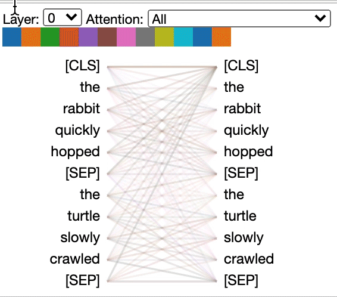

# BertViz

BertViz is a tool for visualizing attention in the Transformer model, supporting all models from the [transformers](https://github.com/huggingface/transformers) library (BERT, GPT-2, XLNet, RoBERTa, XLM, CTRL, etc.). It extends the [Tensor2Tensor visualization tool](https://github.com/tensorflow/tensor2tensor/tree/master/tensor2tensor/visualization) by [Llion Jones](https://medium.com/@llionj) and the [transformers](https://github.com/huggingface/transformers) library from [HuggingFace](https://github.com/huggingface).

#### Interactive Demo
Try out this interactive [Colab Notebook](https://colab.research.google.com/drive/1YoJqS9cPGu3HL2_XExw3kCsRBtySQS2v?usp=sharing) with pre-loaded visualizations.

#### Blog post
[Deconstructing BERT, Part 2: Visualizing the Inner Workings of Attention](https://towardsdatascience.com/deconstructing-bert-part-2-visualizing-the-inner-workings-of-attention-60a16d86b5c1) (Part 1 is not a prerequisite)

#### Paper
[A Multiscale Visualization of Attention in the Transformer Model](https://www.aclweb.org/anthology/P19-3007.pdf)


## Attention-head view

The *attention-head view* visualizes the attention patterns produced by one or more attention heads in a given 
transformer layer. It follows the design of the excellent [Tensor2Tensor visualization tool](https://github.com/tensorflow/tensor2tensor/tree/master/tensor2tensor/visualization) by [Llion Jones](https://medium.com/@llionj). 

Try out this interactive [Colab Notebook](https://colab.research.google.com/drive/1PEHWRHrvxQvYr9NFRC-E_fr3xDq1htCj)
 with the head view pre-loaded.



The attention view supports all models from the Transformers library, including:<br>
 BERT:
 [[Notebook]](head_view_bert.ipynb)
  [[Colab]](https://colab.research.google.com/drive/1PEHWRHrvxQvYr9NFRC-E_fr3xDq1htCj)<br>
 GPT-2:
  [[Notebook]](head_view_gpt2.ipynb)
[[Colab]](https://colab.research.google.com/drive/1c9kBsbvSqpKkmd62u7nfqVhvWr0W8_Lx)<br>
 XLNet: [[Notebook]](head_view_xlnet.ipynb)<br>
RoBERTa: [[Notebook]](head_view_roberta.ipynb)<br>
XLM: [[Notebook]](head_view_xlm.ipynb)<br>
Albert: [[Notebook]](head_view_albert.ipynb)<br>
DistilBert: [[Notebook]](head_view_distilbert.ipynb)<br>
(and others)


## Model view 

The *model view* provides a birds-eye view of attention across all of the model’s layers  and heads.

Try out this interactive [Colab Notebook](https://colab.research.google.com/drive/1c73DtKNdl66B0_HF7QXuPenraDp0jHRS) with
 the model view pre-loaded.


The model view supports all models from the Transformers library, including:<br>
BERT: [[Notebook]](model_view_bert.ipynb)
[[Colab]](https://colab.research.google.com/drive/1c73DtKNdl66B0_HF7QXuPenraDp0jHRS)<br>
GPT2: [[Notebook]](model_view_gpt2.ipynb)
[[Colab]](https://colab.research.google.com/drive/1y-wfC95Z0aASawYqA34LQeV0_qC9mOto)<br>
 XLNet: [[Notebook]](model_view_xlnet.ipynb)<br>
RoBERTa: [[Notebook]](model_view_roberta.ipynb)<br>
XLM: [[Notebook]](model_view_xlm.ipynb)<br>
Albert: [[Notebook]](model_view_albert.ipynb)<br>
DistilBert: [[Notebook]](model_view_distilbert.ipynb)<br>
(and others)

## Neuron view 
The *neuron view* visualizes the individual neurons in the query and key vectors and shows how they are used to compute attention.

Try out this interactive [Colab Notebook](https://colab.research.google.com/drive/1m37iotFeubMrp9qIf9yscXEL1zhxTN2b)
 with the neuron view pre-loaded (requires Chrome).


The neuron view supports the following three models:<br>
BERT: [[Notebook]](neuron_view_bert.ipynb) 
[[Colab]](https://colab.research.google.com/drive/1m37iotFeubMrp9qIf9yscXEL1zhxTN2b)<br>
GPT-2
[[Notebook]](neuron_view_gpt2.ipynb) 
[[Colab]](https://colab.research.google.com/drive/1s8XCCyxsKvNRWNzjWi5Nl8ZAYZ5YkLm_)<br>
RoBERTa
[[Notebook]](neuron_view_roberta.ipynb) 

## Execution
### Running locally

```
git clone https://github.com/jessevig/bertviz.git
cd bertviz
<Install from requirements.txt as needed>
jupyter notebook
```

Click on any of the sample notebooks. You can view a notebook's cached output visualizations by selecting `File > Trust Notebook` (and confirming in dialog)
or you can run the notebook yourself. Note that the sample notebooks do not cover all Huggingface models, but the code should be similar for those not included. 

### Running from Colab
Click on any of the Colab links above, and scroll to the bottom of the page. It should be pre-loaded with the visualization.
 
If you write your own code for executing BertViz in Colab, note that some of the steps are different from those in the Jupyter notebooks (see Colab examples above).

## Limitations

### Tool
* The visualizations works best with shorter sentences and may run slowly if the input text is very long, especially for the Model View.
* When running on Colab, some of the visualizations will fail (runtime disconnection) when the input text is long.
* If you have issues running the tool in Jupyter Lab, try running with a plain Jupyter notebook.
* The Neuron View only supports BERT, GPT-2, and Roberta models. This view needs access to the query and key vectors, 
which requires modifying the model code (see `transformers_neuron_view directory`), which has only been done for these three models.
Also, only one Neuron View may be included per notebook.
####Attention as "explanation"
Visualizing attention weights illuminates a particular mechanism within the model architecture but does not
necessarily provide an *explanation* for model predictions. See [[1](https://arxiv.org/pdf/1909.11218.pdf)], [[2](https://arxiv.org/abs/1902.10186)], [[3](https://arxiv.org/pdf/1908.04626.pdf)].

## Authors

[Jesse Vig](https://twitter.com/jesse_vig)

## Citation

When referencing BertViz, please cite [this paper](https://www.aclweb.org/anthology/P19-3007.pdf).

```
@inproceedings{vig-2019-multiscale,
    title = "A Multiscale Visualization of Attention in the Transformer Model",
    author = "Vig, Jesse",
    booktitle = "Proceedings of the 57th Annual Meeting of the Association for Computational Linguistics: System Demonstrations",
    month = jul,
    year = "2019",
    address = "Florence, Italy",
    publisher = "Association for Computational Linguistics",
    url = "https://www.aclweb.org/anthology/P19-3007",
    doi = "10.18653/v1/P19-3007",
    pages = "37--42",
}
```

## License

This project is licensed under the Apache 2.0 License - see the [LICENSE](LICENSE) file for details

## Acknowledgments
We are grateful to the authors of the following projects, which are incorporated into this repo:
* https://github.com/tensorflow/tensor2tensor
* https://github.com/huggingface/pytorch-pretrained-BERT
